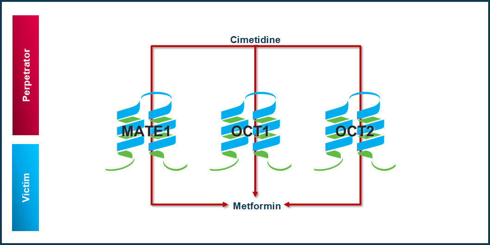

To qualify the OSP suite for the prediction of transporter DDI potential of new drugs, a set of verified PBPK models of perpetrators, and respective victim drugs is specified to set up a OCT/MATE1-transporter-mediated DDI modeling network. 

The following perpetrator compounds were selected: 

- **Cimetidine**
  Model snapshot and evaluation plan (*release* **vx.x**): (under review) https://github.com/Open-Systems-Pharmacology/Cimetidine-Model

The following sensitive OCT/MATE1 substrates as victim drugs were selected:

- **Metformin**
  Model snapshot and evaluation plan (*release* **vx.x**): (under review) https://github.com/Open-Systems-Pharmacology/Metformin-Model
  
**Figure 1** shows the prespecified and developed DDI modeling network of interacting perpetrator and victim drugs for the OSP suite qualification of predicting OCT/MATE1-mediated DDI.

**Figure** **1: OCT/MATE1 DDI modeling**

The arrows indicate where at least one clinical DDI study between the two connected substances was available and included in the model network. Red indicates inhibition and green indicates induction as the primary type of interaction.

The published DDI studies between the respective perpetrators and victim drugs were simulated and compared to observed data. The following sections give an overview of the clinical studies being part of this qualification report. The respective data identifier (DataID) refers to the **ID** of the dataset in the OSP PK database, version 1.6 (https://github.com/Open-Systems-Pharmacology/Database-for-observed-data/releases/tag/v1.6).
